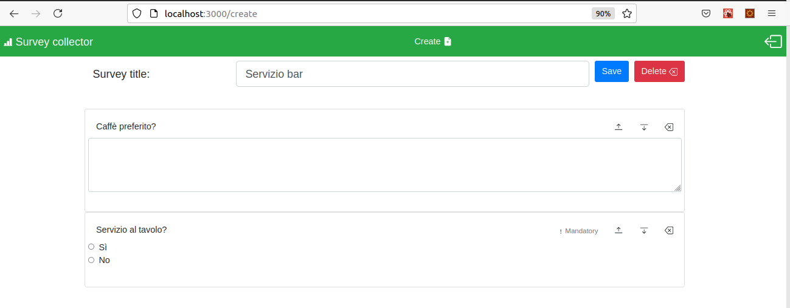

# Exam #1: "Questionario"
## Student: s281599 LASAGNO FRANCESCO 

## React Client Application Routes

- Route `/`: lista di tutti i survey disponibili (per utente non autenticato), lista di tutti i survey creati dall'admin (per utente autenticato)
- Route `/login`: form di login
- Route `/create`: page per creare un nuovo survey (solo per utente autenticato)
- Route `/surveys/:surveyName`: pagina per compilare il survey passato come parametro surveyName (per utente non autenticato), pagina per vedere i risultati di compilazione per il survey passato come parametro surveyName (per utente autenticato)

## API Server

- POST `/api/login`
  - Per fare il login
  - REQUEST
    curl -X POST -H 'Content-Type: application/json' -i http://localhost:3001/api/sessions --data '{"username":"francesco.lasagno@gmail.com","password":"password"}'
  - RESPONSE
    {"id":1,"username":"francesco.lasagno@gmail.com","author":"Francesco"}

- DELETE `/api/sessions/current`
  - Per fare il logout
  - REQUEST
    curl -X DELETE -i http://localhost:3001/api/sessions/current

- GET `/api/sessions/current`
  - Per stabilire se la sessione corrente è autenticata
  - REQUEST
		curl -X GET -i http://localhost:3001/api/sessions/current
  - RESPONSE (user autenticato)
    HTTP/1.1 200 OK
    x-powered-by: Express
    content-type: application/json; charset=utf-8
    content-length: 70
    etag: W/"46-9JRFRTuleoAcYYF+oVF/fPcy0Jw"
    date: Sun, 27 Jun 2021 17:52:23 GMT
    connection: close
    Vary: Accept-Encoding

    {"id":1,"username":"francesco.lasagno@gmail.com","author":"Francesco"}
  
  - RESPONSE (user non autenticato)
    Status 401
    Unauthorized
    VersionHTTP/1.1
    Transferred273 B (33 B size)
    Referrer Policystrict-origin-when-cross-origin

    {"error":"Unauthenticated user!"}

- GET `/api/surveyAnswers/:surveyName`
  - Restituisce tutte le risposte al sondaggio specificato
  - surveyName: nome del sondaggio
  - response: un array con tutte le risposte al sondaggio richiesro se l'utente è autenticato ed è l'autore del sondaggio
  - REQUEST
		curl -X GET -i http://localhost:3001/api/surveyAnswers/Men%C3%B9
  - RESPONSE:
    {"success":[
      {"surveyName":"Menù","utilizzatore":"Luca",
        "questions":[{"id":1,"type":"close","answer":[true,true,false,false]},{"id":2,"type":"close","answer":[true,false,false]},{"id":3,"type":"close","answer":[false,false]},{"id":4,"type":"close","answer":[false,false,false,false]},{"id":5,"type":"open","answer":"Limoncello"},{"id":6,"type":"open","answer":"Tutto ok"}]},
      {"surveyName":"Menù","utilizzatore":"Marco",
        "questions":[{"id":1,"type":"close","answer":[false,false,false,true]},{"id":2,"type":"close","answer":[false,false,true]},{"id":3,"type":"close","answer":[true,false]},{"id":4,"type":"close","answer":[false,true,false,false]},{"id":5,"type":"open","answer":""},{"id":6,"type":"open","answer":""}]},
      {"surveyName":"Menù","utilizzatore":"Marta",
        "questions":[{"id":1,"type":"close","answer":[false,false,true,false]},{"id":2,"type":"close","answer":[true,false,false]},{"id":3,"type":"close","answer":[false,false]},{"id":4,"type":"close","answer":[true,false,false,false]},{"id":5,"type":"open","answer":"Nessuno"},{"id":6,"type":"open","answer":"Tutto a posto"}]},
      {"surveyName":"Menù","utilizzatore":"Sebastiano",
        "questions":[{"id":1,"type":"close","answer":[false,true,false,false]},{"id":2,"type":"close","answer":[false,false,true]},{"id":3,"type":"close","answer":[false,true]},{"id":4,"type":"close","answer":[false,false,false,true]},{"id":5,"type":"open","answer":""},{"id":6,"type":"open","answer":""}]
      }
    ]}

- GET `/api/surveys/:surveyName`
  - Restituisce tutte le domande del sondaggio specificato
  - surveyName: nome del sondaggio
  - response: un array con tutte le domande del sondaggio richiesto (nel caso l'utente fosse autenticato viene controllato che sia anche l'autore del sondaggio)
  - REQUEST:
		curl -X GET -i http://localhost:3001/api/surveys/Men%C3%B9
  - RESPONSE:
    {"success":
      {"surveyName":"Menù",
      "questions":
        [
          {"question":"Antipasto","type":"close","min":0,"id":1,"max":2,"answer":["Albese","Insalata primavera","Vitello tonnato","Flan di verdure"]},
          {"question":"Primo","type":"close","min":1,"id":2,"max":1,"answer":["Risotto","Pasta al ragù","Agnolotti"]},
          {"question":"Secondo","type":"close","min":0,"id":3,"max":1,"answer":["Bistecca ai ferri","Filetto di trota"]},
          {"question":"Dessert","type":"close","min":0,"id":4,"max":1,"answer":["Macedonia","Gelato","Tiramisù","Panna cotta"]},
          {"question":"Digestivo","type":"open","mandatory":false,"id":5},
          {"question":"Note sul servizio?","type":"open","mandatory":false,"id":6}
        ]
      }
    }

- GET `/api/surveys`
  - Restituisce l'elenco dei sondaggi (nome, autore, compilazione, ...) ma non i dettagli di compilagione (e.g. domande)
  - response: array dei sondaggi. Se l'utente non è autenticato vengono restituiti tutti i sondaggi (senza info sul numero di compilazioni), se l'utente è autenticato vengono considerati solo i sondaggi realizzati da quell'admin (con info sul numero di compilazioni)
  - REQUEST: 
		curl -X GET -i http://localhost:3001/api/surveys
  - RESPONSE: (user non loggato)
    {"success":
      [{"surveyName":"Menù","author":"Francesco"},
      {"surveyName":"Menù bar","author":"Francesco"},
      {"surveyName":"Attività fisica","author":"Luca"},
      {"surveyName":"Sport seguiti","author":"Luca"}]
    }
  - RESPONSE: (user loggato)
    {"success":
      [{"surveyName":"Menù","author":"Francesco","numComp":4},
      {"surveyName":"Menù bar","author":"Francesco","numComp":1}]
    }

- POST `/api/surveyAnswers`
  - Per salvare nel db una compilazione ad un sondaggio
  - request body content: nome del sondaggio, dell'utilizzatore ed elenco di risposte
  - response body content: success/error
  - REQUEST:
		curl -X POST -H 'Content-Type: application/json' -i http://localhost:3001/api/surveyAnswers --data '{"surveyName":"Menù","utilizzatore":"Sofia","questions":
      [{"type":"close","id":1,"min":0,"max":2,"answer":[true,false,false,true]},
      {"type":"close","id":2,"min":1,"max":1,"answer":[false,false,true]},
      {"type":"close","id":3,"min":0,"max":1,"answer":[false,true]},
      {"type":"close","id":4,"min":0,"max":1,"answer":[true,false,false,false]},
      {"type":"open","id":5,"mandatory":false,"answer":"No"},
      {"type":"open","id":6,"mandatory":false,"answer":""}]}'
  - RESPONSE:
    {"success":"sending survey compiled"}

- POST `/api/surveys`
  - Per aggiungere un nuovo sondaggio (richiede di essere admin)
  - request body content: nome del sondaggio e elenco domande, l'autore del sondaggio è preso dal cookie di sessione
  - response body content: success/error
  - REQUEST:
    curl -X POST -H 'Content-Type: application/json' -i http://localhost:3001/api/surveys --data '{"surveyName":"Servizio bar","questions":
      [{"question":"Caffè preferito?","type":"open", "mandatory":false,"id":0},
      {"question":"Servizio al tavolo?","type":"close","min":1,"max":1,"answer":["Sì","No"],"id":1}]}'
  - RESPONSE:
    {"success":"creating a survey"}

## Database Tables

- Table `USERS` - contains Id Email Password Author - per gestire il login
- Table `SURVEYS` - contains SurveyName Author - lista dei sondaggi
- Table `SURVEY_QUESTS` - contains SurveyName Id Question Type Min Max Mandatory - contiene le domande ai sondaggi
- Table `QUEST_OPTS` - contains SurveyName Id Incr Answer - contiene le opzioni di risposta per le domande chiuse
- Table `SURVEY_COMPS` - contains IdCompilazione SurveyName Utilizzatore - contiene le stat delle compilazioni fatte
- Table `SURVEY_ANS_COMP` - contains pk, IdCompiliazione, Id, Type, Answer - contiene le risposte ai sondaggi

## Main React Components

- `LoginForm` (in `LoginForm.js`): form per fare il login
- `NavbarCst` (in `Navbar.js`): navbar superiore per muoversi tra le varie pagine
- `Survey` (in `Survey.js`): contenitore del sondaggio che si vuole compilare
- `SurveyStats` (in `Survey.js`): contenitore del sondaggio e di tutte le sue compilazioni
- `Sidebar` (in `Survey.js`): barra laterale per cambiare il sondaggio corrente
- `SurveyCreate` (in `SurveyAdmin.js`): componente per creare nuovi sondaggi
- `FormAddQuestion` (in `SurveyAdmin.js`): modale per aggiungere una nuova domanda al questionario
- `SurveyListUser` (in `SurveyList.js`): lista dei sondaggi per gli utilizzatori
- `SurveyListAdmin` (in `SurveyList.js`): lista dei sondaggi per gli admin
- `SurveyContainer` (in `SurveyContainer.js`): wrapper a SurveyListUser/SurveyListAdmin che richiama il componente corrente a seconda che l'utente corrente sia loggato o meno

## Screenshot

## Users Credentials

- francesco.lasagno@gmail.com, password
- luca.rosso@gmail.com, 1234567890
